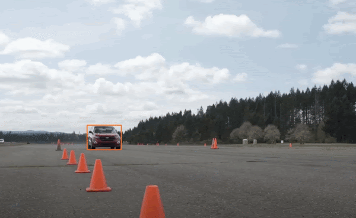

# SCSE
- Single Camera Speed Estimation
- With [YOLOv5](https://github.com/ultralytics/yolov5), [Deepsort](https://github.com/mikel-brostrom/Yolov5_DeepSort_Pytorch/blob/master/track.py), [MonoDepth2](https://github.com/nianticlabs/monodepth2)

## Prototype
- https://aigobaeya.github.io/

## Output

### Reference
- [YOLOv5](https://github.com/ultralytics/yolov5)
- [YOLOv5+Deepsort](https://github.com/mikel-brostrom/Yolov5_DeepSort_Pytorch/blob/master/track.py)
- [MonoDepth2](https://github.com/nianticlabs/monodepth2)
